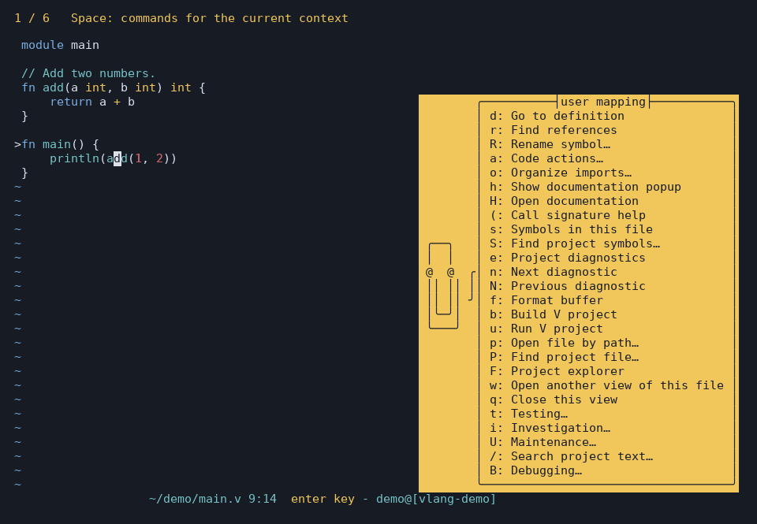

# vlang.kak

A V development environment for [Kakoune](https://github.com/mawww/kakoune). It combines V syntax and editing support with [VLS](https://github.com/vlang/vls) through [kak-lsp](https://github.com/kakoune-lsp/kakoune-lsp), project tasks, search, diagnostics, local GDB debugging, and Kakoune user-mode shortcuts.

The plugin still provides syntax highlighting, indentation, :v-run, and :v-fmt when VLS is unavailable. Language features depend on the capabilities of the installed VLS version.

This short demonstration is recorded from a real isolated Kakoune session.
See [the demo details](docs/demo.md) and [contribution guide](CONTRIBUTING.md).

## Quick start

Setup uses a compatible V compiler from your PATH, or builds a separate managed compiler when needed for the V helpers or upstream VLS. It preserves your existing compiler. Use `--managed-v` to select the release-tested compiler or `--system-v` to require your own compiler. An existing VLS binary can be supplied with `--vls /path/to/vls`.

~~~sh
git clone https://github.com/antono2/vlang.kak.git
cd vlang.kak
./scripts/setup.sh
~/.local/bin/kak-v path/to/main.v
./scripts/check.sh
./scripts/check.sh --live-lsp
~~~

setup.sh builds the latest tagged Kakoune release, installs the latest tagged kak-lsp release, and builds the latest upstream VLS commit under ~/.local. It does not replace system packages. The managed ~/.local/bin/kak launcher selects that Kakoune build and its matching runtime. ~/.local/bin/kak-v starts an isolated V IDE configuration, so older settings in your personal kakrc cannot interrupt the quick start.

Setup leaves your regular `kakrc` and autoload entries unchanged by default. It creates `~/.config/kak/vlang-user.kak` only if absent; put personal V IDE settings there. The isolated `kak-v` launcher loads this file, and setup/update preserve its contents and original location. To explicitly enable the IDE in your regular Kakoune configuration too, run `./scripts/setup.sh --integrate`. That adds autoload links and a marked kakrc block, preserves settings outside that block, and backs up kakrc. Conflicting files or links cause setup to stop with instructions instead of replacing them. Existing integrated installations retain their integration choice. See the [customization guide](docs/customization.md) for XDG paths and key overrides.

The setup scripts target Linux. Building Kakoune needs Git, Make, and a C++ compiler accepting -std=c++2b. The prebuilt kak-lsp installer supports Linux x86_64 and needs curl and tar. On another Linux architecture, install kak-lsp yourself and run ./scripts/setup.sh --no-lsp --vls /path/to/vls. To use a suitable system Kakoune without building one, add --no-build. The default project explorer uses V; setup compiles its helper into the user cache, and an updated helper is rebuilt automatically. Local debugging uses GDB 14 or newer with DAP/Python support and GCC; setup prepares the V debugger helper when GDB is installed. Python 3 is needed only for the live VLS check and test suite; timeout is needed only for the test suite.

To use a different prefix, pass --prefix /absolute/directory to setup and use its bin/kak-v launcher. If V is outside your usual PATH, add it before running setup and launching Kakoune. Setup links managed VLS into its prefix, and kak-lsp inherits that prefix on its PATH. Pass `--vls /absolute/path/to/vls` to use your own build instead.

The plugin and its test harness use Kakoune's POSIX shell integration. On a
Windows machine, use it inside WSL with Kakoune and V installed in the same WSL
distribution. A native Win32 Kakoune environment is not currently tested.

## Update

~~~sh
cd vlang.kak
./scripts/update.sh
./scripts/check.sh
./scripts/check.sh --live-lsp
~~~

Update fast-forwards a clean plugin checkout, installs the newest tagged Kakoune and kak-lsp releases, and builds the latest upstream VLS commit. If the checkout has local changes, it leaves them in place and still updates the managed tools. It preserves `vlang-user.kak`. Rerunning setup or update with the same versions is safe; previous versioned tool installs remain available. An externally linked VLS is preserved on update; pass `--vls-upstream` to switch it to the managed upstream build or `--vls PATH` to relink another build. A managed V compiler follows the release-tested pin; an external V compiler is kept.

Run `scripts/setup.sh` once after upgrading an older installation to refresh its `kak-v` launcher. From a session started by that launcher, run `:v-update` (`Space U u`) to update inside Kakoune, including managed VLS. The command shows progress in `*make*`, then restarts Kakoune and reopens disk-backed buffers at the previous active file and cursor. It accepts the same update options except `--prefix`; for example, `:v-update --vls-ref COMMIT` selects an upstream VLS revision. Save your edits before updating. If unsaved edits prevent the automatic restart, save them and run `:v-restart`. The restart requires a single Kakoune client; reopen scratch buffers and other clients afterwards. See the [update workflow](docs/customization.md#installation-and-updates) for details.

`./scripts/check.sh --live-lsp` runs a VLS protocol check and opens a temporary Kakoune session through the managed launcher. It checks documentation hover, call signature help, references, call hierarchy, syntax selection, definition, rename, import organization, unsaved diagnostics, and formatting without changing your project files. Run it after updating the IDE. For a custom prefix, set `VLANG_KAK_PREFIX` first.

To select a particular release, use --kakoune-version vYYYY.MM.DD and --lsp-version vMAJOR.MINOR.PATCH with either setup or update. Use `--vls-ref TAG_OR_COMMIT` for a specific upstream VLS revision. These options can also switch back to an earlier installed release. scripts/build-kakoune.sh, scripts/install-kak-lsp.sh, and scripts/install-vls.sh can be run separately.

## Key bindings

In a V buffer, press `Space` to open Kakoune's user mode. The menu shows actions useful in the current buffer; press one more key to run an action. Source files, V task output, and VLS result lists have different menus. Other file types keep their existing user keys. Less frequent actions are grouped under Testing, Investigation and Maintenance. The table below lists source bindings; unavailable actions are hidden.

| Keys | Actions |
| --- | --- |
| `Space d`, `g`, `r`, `R`, `a`, `o` | Definition/peek, references, rename, code actions, organize imports |
| `Space h`, `H`, `(`, `s`, `S` | Documentation popup, documentation view, call signature help, file symbols, project-symbol search |
| `Space e`, `n`, `N` | Diagnostics, next/previous diagnostic |
| `Space f`, `b`, `u`, `[`, `]` | Format, build, run project, previous/next task error |
| `Space p`, `P`, `F`, `/`, `w`, `q` | Open by path, find project file, project explorer, project text search, another view of this file, close view |
| `Space t` → `t`, `T`, `x`, `C`, `v` | Testing: project tests, test at cursor, repeat test, check file, vet |
| `Space i` → `c`, `D`, `i`, `m`, `z`, `j`, `k`, `l`, `V` | Investigation: declaration, type definition, implementation, reference highlighting, syntax selection, caller/callee searches, code-lens actions, file at a Git revision |
| `Space U` | Maintenance: updates, settings, health, recovery, rollback and cleanup |
| `Space B` | Debugging setup submenu before launch (available actions only) |
| `Space E`, `O`, `I`, `A`, `G`, `M`, `L`, `!` | Continue, step over/into/out, run to cursor, stack, variables/watches, breakpoint (while paused) |
| `Space ?`, `W`, `-`, `:` | Evaluate, add/remove watch, native GDB command (while paused) |
| `Space K`, `J`, `Q`, `Z` | Pause and send input (while running), debug output and stop (while active) |

`Space P` (**Find project file…**) is a completion-based path picker;
`Space F` (**Project explorer**) opens the interactive tree. When the explorer
is disabled, F becomes **Open project path…**. Definition peek is shown when
pane support is available; documentation remains available through H.

VLS formatting edits the buffer without saving. Without VLS, f is labelled
**Format and save with V**. Call signature help applies at function calls;
hover/documentation also contains the function declaration. File history opens
a read-only revision rather than a comparison view. Debug output includes both
the program's output and debugger messages.

For example, `Space o` opens Organize Imports; press Enter to apply it. `Space R` prompts for a new name. The `:v-*` commands remain available, and [customization](docs/customization.md#key-bindings) explains how to override any shortcut.

Testing menus show `T` only in saved `_test.v` files containing a test and `x` after a test has run. In saved test files these actions are also directly available as `Space T` and `Space x`. Investigation shows `V` for tracked Git files. LSP actions require LSP enabled in a named buffer; without it, `f` uses `v fmt`. Read-only views hide editing actions. New-view and update actions depend on the active window backend and managed launcher. Task-error keys appear after a V task has produced an output buffer.

In V task output, `Space r` reruns that exact task, `Space x` reruns the last test, `Space Enter` opens the location on the current line, `Space [` / `]` navigate errors, and `Space q` returns to the original source and cursor. The project tree offers its open/preview/expand/collapse/hidden/refresh/return actions under Space as well as direct keys. Documentation offers `Space q`, direct `q`, and Escape to return to the original source selection. Symbol/diagnostic result lists offer `Space n` / `N`, `Space Enter`, and `Space q` alongside their existing direct controls.

Set `v_context_keys false` to show all actions within the source submenus. See the [customization guide](docs/customization.md#key-bindings) for personal overrides.

## Debugging

Install GDB with DAP support and open a saved V source file. `Space B`
opens the debugging submenu: `!` toggles a breakpoint and `B` builds and
launches. Without breakpoints it keeps running; V panics, assertion failures
and native runtime faults stop for inspection.

At a stop, use `Space O` to step over, `Space I` to step into,
`Space A` to step out, and `Space E` to continue. Move to a saved executable
line and use **`Space G` to run to cursor** with a one-time breakpoint.
`Space M` opens stack frames, `Space L` shows locals and watches, and
`Space Q` opens output. These actions are directly under Space throughout an
active session. Enter selects a frame or expands a variable; `q` returns to
source from a debugger panel. `Space Z` stops.

Launching opens the output buffer. While running, press **Enter** there to
enter a line of program input and Enter again to send it. Escape cancels the
prompt. From source, `Space J` sends input and `Space K` pauses execution.
Menus follow debugger state. The verified backend is local Linux GDB;
[debugging](docs/debugging.md) covers prerequisites, tests, expressions,
conditional breakpoints, custom builds, prebuilt executables and all settings.
Use `v_debug_enabled false` to hide debugger launch/breakpoint entries. Stop
debugging before an in-editor update or restart.

## Investigation loop

The user menu includes `H` for a documentation scratch buffer, `(` for function signature help, `g` for a definition peek, `P` for a project-file picker, `V` for file history, `w` for another Kakoune client, and `q` to close the current client. The commands are `:v-doc`, `:v-signature`, `:v-peek-definition`, `:v-project-files`, `:v-history`, `:v-new-view`, and `:v-close-view`. In a tree or definition peek pane, press `q` to close it; other extra views use `Space q` or `:v-close-view`. `:v-doc` shows the installed VLS hover response; upstream VLS at commit `436058d` returns the declaration and doc comment together when the cursor is inside the function name. `:v-signature` shows the function signature and active parameter inside a call. `:v-hover` (`Space h`) remains the small inline info box. These LSP commands show what the installed VLS provides; signature and documentation requests need the corresponding server capability.

In a saved `_test.v` file, `:v-test-nearest` (`Space T`) runs the `test_` function at or above the cursor; before the first test, it runs that first test. `:v-repeat-test` (`Space x`) reruns the last `:v-test-nearest` or project `:v-test` command, even after switching files. Both use Kakoune's `*make*` output buffer. Save edits before running a test at the cursor; the command selects from the saved file.

`Space s` opens a persistent document-symbol list. Tab/Shift-Tab browse, Enter opens the selected symbol, and `q` or Escape returns to the original file and cursor. `Space S` asks for a project-symbol query; Enter submits it and opens the same kind of list. References, calls, and diagnostics also show these controls in their modeline. You can use `/` to search within a result list.

After a V task, `:v-next-task-error` (`Space ]`) and `:v-previous-task-error` (`Space [`) jump between compiler errors and failed test assertions in `*make*`. Press `<ret>` on a failure line in that buffer to jump directly. These task errors are separate from VLS diagnostics (`Space n` and `Space N`).

The project picker uses Kakoune's fuzzy command completion. It searches from the nearest `v.mod` or Git root, using `rg --files` when available, then Git or `find` as fallback. `:v-project-path` (`Space F`) opens the built-in interactive tree: Enter opens a file or expands a folder, `p` previews, `.` toggles hidden entries, and `q` returns to the source. When a supported pane host is active, the tree opens beside the source and Enter opens files in the original client; `q` closes the tree pane. The tree header shows the appropriate `q` action. Open a file from anywhere with `:v-files`. `:v-search` (`Space /`) previews matches while you type; Enter opens all project results in Kakoune's navigable `*grep*` buffer. For advanced searches, use `:grep [OPTIONS] PATTERN [PATH...]` directly. `:v-symbols` and `:v-workspace-symbols` navigate functions and other symbols.

The tree and live search are enabled by default. Setup accepts `--no-explorer` and `--no-live-search` to turn them off, or `--explorer` and `--live-search` to turn them back on. The same choices can be changed inside Kakoune with `:set-option global v_explorer_enabled false` and `:set-option global v_live_search_enabled false`. With the tree off, `:v-project-path` uses Kakoune's path completion; project search remains available without live previews. Add settings to `vlang-user.kak` to keep them across updates.

Pane mode defaults to `auto`: the current client's tmux, Zellij, WezTerm, or kitty environment is detected when a command runs. GNU Screen and Kakoune's native desktop terminal support are also available. `:v-peek-definition` (`Space g`) opens the definition in a second client while preserving the source cursor; without a pane host, it shows `:v-doc`. `:v-window-status` reports the detected backend. Set `v_pane_mode` to `off` for a single-client UI or `always` to report an error when a pane cannot open. Set `v_window_backend` to a specific provider to override detection. Setup accepts `--pane-mode` and `--window-backend`; updates preserve both choices. See the [customization guide](docs/customization.md#window-and-pane-management).

`:v-history` lists recent commits for the current file. `:v-history-file HEAD~1` opens that revision in a read-only V scratch buffer while leaving the working file untouched. Kakoune's `:git diff -- path/to/file.v` shows uncommitted changes, while `:git diff HEAD~1 HEAD -- path/to/file.v` compares two revisions. The [investigation guide](docs/customization.md#investigation-workflows) includes a two-view workflow. Kakoune uses multiple clients on one session for side-by-side editing: use `:v-new-view` (`Space w`), then select the live file or a historical buffer in each client with `:buffer`.

## Commands and options

v-definition, v-declaration, v-type-definition, v-references, v-highlight-references, v-select-syntax, v-implementation, v-rename, v-rename-to, v-code-actions, v-organize-imports, v-hover, v-doc, v-signature, v-symbols, v-workspace-symbols, v-diagnostics, v-incoming-calls, v-outgoing-calls, v-code-lens, v-format, and v-next-diagnostic/v-previous-diagnostic use VLS through kak-lsp. v-inlay-hints-enable and v-inlay-hints-disable control inline hints. Kak-lsp supplies automatic completion and inline diagnostics after it connects to VLS.

v-files opens Kakoune's file completion prompt. v-project-files lists project files through fuzzy completion; v-project-path opens the project tree by default, with path completion available when the tree is disabled. v-find searches the current buffer. v-search previews project matches as you type, then opens navigable *grep* results on Enter. v-check-file, v-build, v-run-project, v-test, v-test-nearest, v-repeat-test, and v-vet run asynchronously in Kakoune's navigable *make* buffer. They choose the nearest v.mod or Git root when forming the command; rerun uses the original command and root. v-check-file appends the current file's absolute path to `v_check_command` (default `v -check`). The other defaults are `v .`, `v -keepc -cg run .`, `v test .`, `v test -run-only NAME FILE`, and `v vet .`.

The original v-run shows output in the info box and *debug* buffer. v-fmt formats through the V compiler and saves only after successful formatting. v_fmt_command must read from standard input and write formatted code to standard output; its default is v fmt. To change a V option for a session:

~~~kak
set-option buffer v_test_command 'v test ./tests'
~~~

V files (.v, .vsh, .vv, .c.v) are recognized automatically. v.mod uses JSON highlighting. :alt switches between a .v file and its _test.v counterpart. :v-enable-indenting and :v-disable-indenting control the editor's V indentation hooks.

## Other installation methods

For syntax and editing support without the managed setup, use [plug.kak](https://github.com/andreyorst/plug.kak):

~~~kak
plug "antono2/vlang.kak"
~~~

You can also clone the repository under Kakoune's autoload directory or source the absolute path to rc/vlang.kak from your kakrc. To add VLS features yourself, put vls on PATH and start kak-lsp in your kakrc:

~~~kak
eval %sh{kak-lsp}
set-option global lsp_cmd 'kak-lsp --session "$kak_session"'
~~~

The plugin configures kak-lsp's V server when a V buffer opens.

## Testing

The [automated acceptance checks](docs/release-candidate.md) exercise the complete
IDE workflow; users are not required to perform manual testing.
The [weekly update process](docs/release.md#weekly-kakoune-master-updates) tests
Kakoune master and proposes verified tool-pin updates.

Report reproducible problems using the [issue forms](https://github.com/antono2/vlang.kak/issues/new/choose).
For questions, personal configurations and workflow examples, use
[Discussions](https://github.com/antono2/vlang.kak/discussions).

Run `python3 tests/debugger.py /path/to/kak` for real GDB/editor debugging
coverage. The managed release gate includes this check. See
[debugging](docs/debugging.md) for prerequisites and the tested scope.

The integration suite covers settings preservation, failed updates, editor commands, user-key bindings, test selection and rerun, task failure navigation, file history, filetype detection, rendered syntax highlighting, formatting, editing hooks, and a compiling V sample. It runs with the distribution Kakoune and the current tagged release in CI.

~~~sh
./tests/run.sh

# Test an uninstalled Kakoune build:
KAK=/path/to/kakoune/src/kak \
KAKOUNE_RUNTIME=/path/to/kakoune/share/kak \
./tests/run.sh
~~~

See [setup and maintenance automation](docs/automation.md) for dependency preparation, ownership-based removal, staged updates/rollback, health and repair, persistent settings, project arguments, recovery snapshots and optional release notifications.

The standalone scripts accept --help. Run scripts/check.sh after setup to see which executables and configuration links are in use.

For persistent command, server, search, key, syntax, and installation settings, see the [customization guide](docs/customization.md).

Release support, tested tool versions, experimental pane adapters, recovery, and removal instructions are in the [release guide](docs/release.md). The full managed-installation gate is `./tests/release.sh /absolute/artifact-directory`; CI runs it with real VLS and tmux. The release gate includes local GDB debugging, program input and V value inspection.
